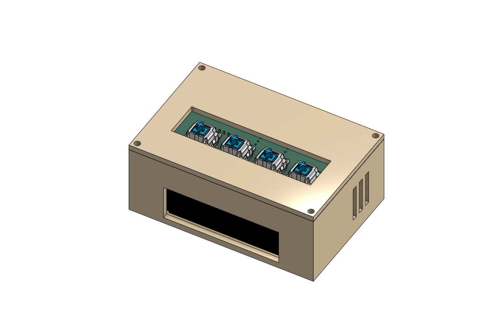
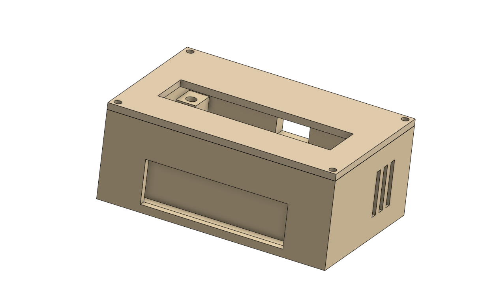
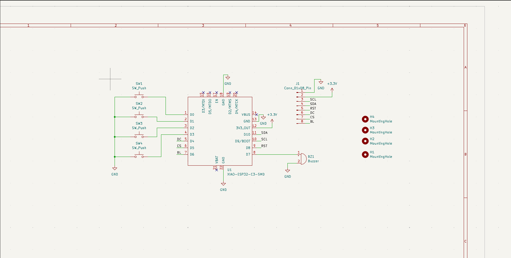
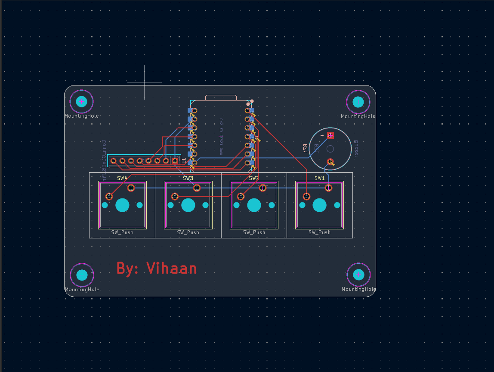

# Nova Clock 

Nova Clock is a custom desktop alarm clock powered by an XIAO ESP32-C3 microcontroller, featuring an ST7789 2.25" TFT display, a 4-button tactile switch interface, and a piezo buzzer housed in a custom 3D printed enclosure. This is my first hardware project for which I have made everything from designing the PCB, making the case to making the firmware. It is all thanks Stardance and Hack Club for helping and inspring me to push my self to making this.

## Gallery

| Overall Clock | Case Fit |
| :---: | :---: |
|  |  |

| Schematic | PCB Layout |
| :---: | :---: |
|  |  |

---

##  Bill of Materials (BOM)

| Component | Quantity | Description |
| :--- | :---: | :--- |
| Seeed Studio XIAO ESP32C3 | 1 | Microcontroller Board |
| ST7789 2.25" TFT Display | 1 | 240x320 SPI LCD |
| MX Key Switches | 4 | Mechanical switches (Stop, Mode, Up, Down) |
| Piezo Buzzer | 1 | 12x9.5mm Active/Passive Buzzer |
| Custom 2-Layer PCB | 1 | Designed in KiCad |

---
