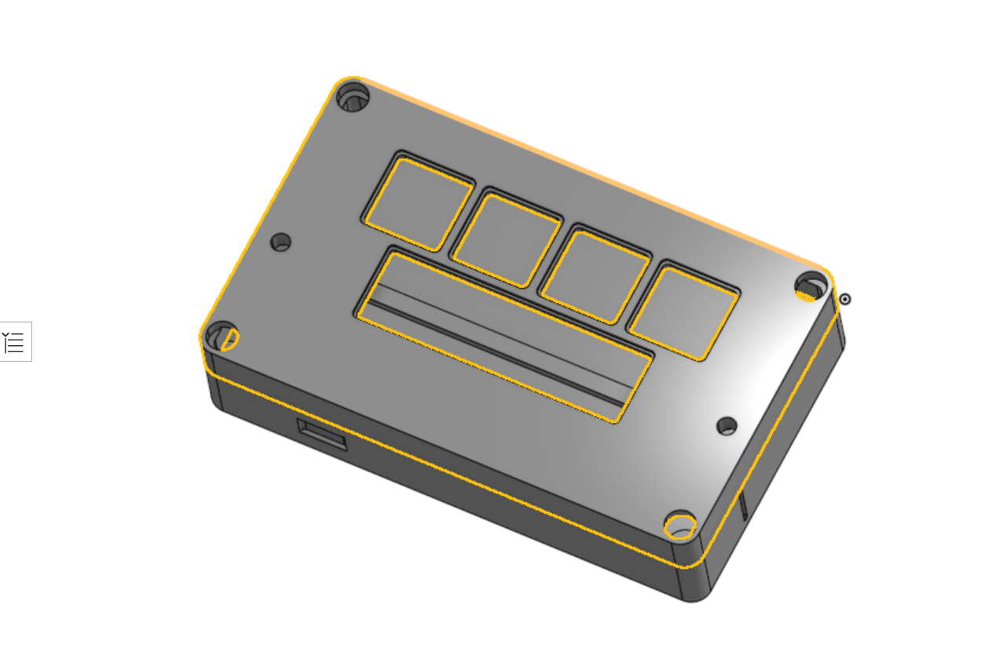
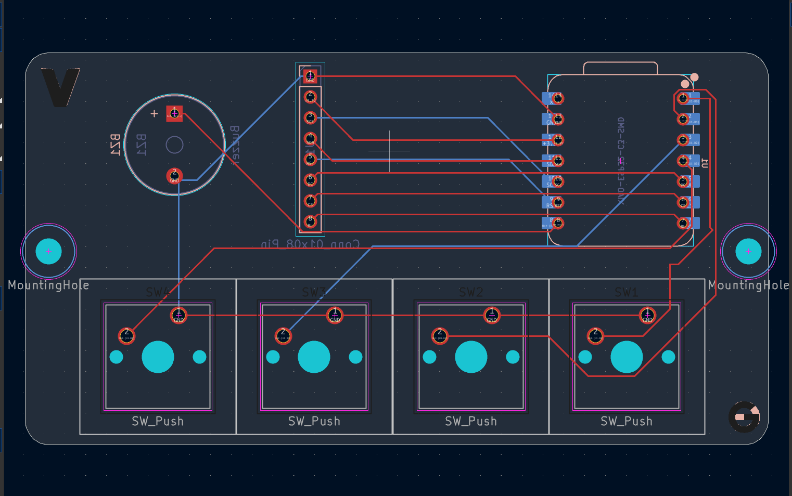
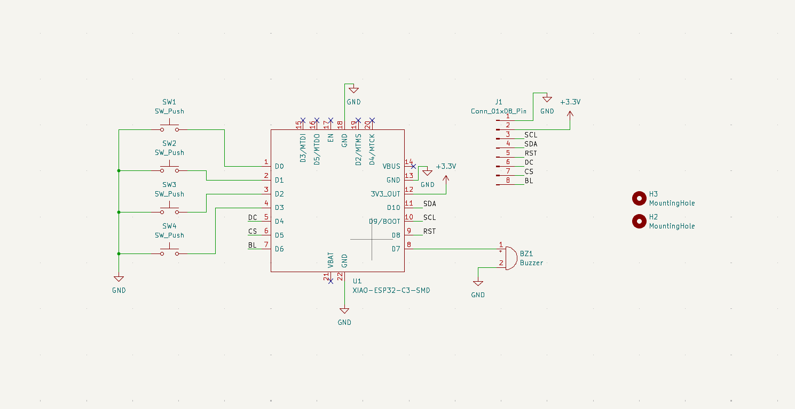

# Nova Clock

Nova Clock is a custom desktop alarm clock built around a Seeed Studio XIAO ESP32-C3. It has a 2.25-inch TFT display, four mechanical keyboard switches, a piezo buzzer, a custom PCB, and a custom 3D-printed enclosure. The PCB, enclosure, and firmware were all designed as part of the same project so the electronics and the case fit together as one system.

## Why I made it

I wanted to build a project that was more than just a basic clock. I wanted to learn how a real hardware product comes together, from designing the PCB and enclosure to writing the firmware and planning how the final device would actually be used.
I also wanted the clock to be something I could keep improving later, especially the display styles, alarms, sounds, and the way it can be configured from another device.

## Project

The final design uses a custom PCB with the XIAO ESP32-C3 as the main controller. The four switches are used for local controls, while the TFT is used for the clock and other information. The buzzer provides startup and alarm sounds.

The enclosure was designed around the PCB so the board can be mounted securely while still leaving access to the USB port, display, switches, and buzzer. The display is held in place with a separate retainer so it can be removed without having to glue it into the case.

## How I planned the firmware

The firmware is included in the repository as a working prototype for the hardware design. The main idea is:

- show a short Nova Clock startup animation
- play a startup beep
- display the current time
- use the buttons for local clock and alarm controls
- store alarm settings on the ESP32-C3
- connect the clock to Wi-Fi
- provide a local web interface for changing alarm and display settings
- support different display styles and alarm sound patterns

The physical hardware is not available while the firmware was being made, so the final hardware behavior will be verified after the components arrive.

## Project images

### Case fit

### PCB

### Schematic / wiring

The display is connected to the PCB using the 8-pin header and jumper wires included in the kit.

## Files

The repository contains the KiCad project and PCB source files, the CAD source and STEP assembly, the firmware, manufacturing files, and the project images.

- `PCB/` - KiCad project, schematic, PCB layout, and manufacturing files
- `CAD/` - enclosure source files and final STEP assembly
- `Firmware/` - Nova Clock firmware
- `Production/` - production/export files
- `assets/` - screenshots and project images

## Bill of Materials

| Component | Quantity Used | Quantity in Kit | Description | Link |
|---|---:|---:|---|---|
| Seeed Studio XIAO ESP32-C3 | 1 | 1 | Main microcontroller | [Seeed documentation](https://wiki.seeedstudio.com/XIAO_ESP32C3_Getting_Started/) |
| MX-style keyboard switch | 4 | 12 | Mechanical switches | [Switch specification](https://cdn.shopify.com/s/files/1/0565/8070/2297/files/SPEC-KS-3Y10B050NW-X1-Yellow_Switch.pdf?v=1675841028) |
| White blank DSA keycap | 4 | 12 | Keycaps for the switches | — |
| 1N4148 through-hole diode | 4 | 12 | Switch matrix diodes | [Vishay 1N4148 datasheet](https://www.vishay.com/docs/81857/1n4148.pdf) |
| 2.25-inch TFT display | 1 | 1 | Main clock display | — |
| 3.3 V piezo buzzer | 1 | 1 | Startup and alarm sound | — |
| 2.54 mm 8-pin male header | 1 | 1 | Display connector | — |
| 20 cm female-female jumper wire | 8 | 8 | Display wiring | — |
| M3x5x4 heat-set insert | 8 | 8 | Case, PCB, and display mounting | [Insert source](https://www.aliexpress.us/item/2255800046543591.html) |
| M3x8 screw | 4 | 4 | PCB/display-retainer mounting | — |
| M3x16 screw | 4 | 4 | Main enclosure screws | — |
| Custom 2-layer PCB | 1 | 1 | PCB designed in KiCad | [Project PCB](PCB/) |
| 3D-printed enclosure | 1 | 1 | Custom Nova Clock case | [Project CAD](CAD/) |
